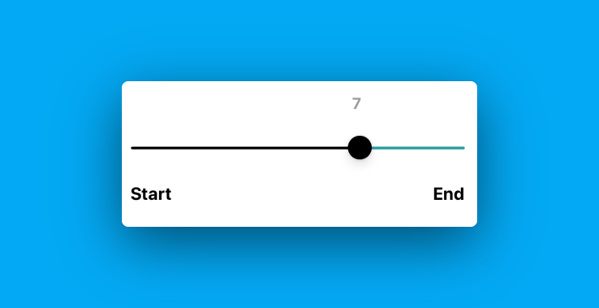
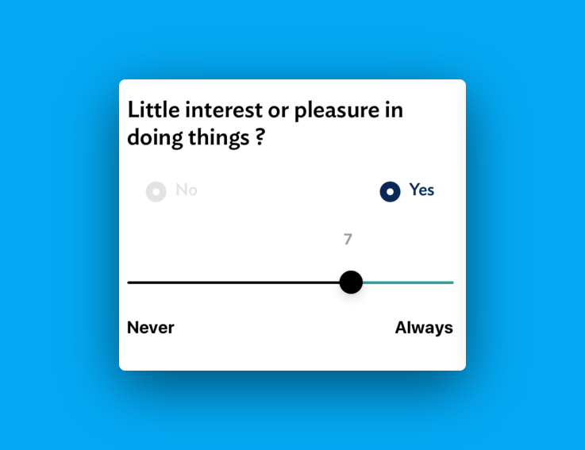

# React Native Slider Text

Read more about this package [here](https://medium.com/@sudhirKr/react-native-slider-text-7f5054f733dd).

[](http://npm-stats.com/~packages/react-native-slider-text)
[](https://www.npmjs.com/package/react-native-slider-text)
[](https://github.com/vikrantnegi/react-native-slider-text/)
[](https://yarnpkg.com/en/package/react-native-slider-text)

A React Native Slider Component which is built around [react-native-slider](https://github.com/react-native-community/react-native-slider) providing the user ability to add moving slider value alongside the slider thumb. You can also add custom labels displaying the start text and end text below the slider.

 &nbsp;&nbsp;
 &nbsp;&nbsp;

# Prerequisites

Kindly install @react-native-community/slider before you start using this component.

```
yarn add @react-native-community/slider
```

### Using React Native CLI

## Install

```
yarn add react-native-slider-text
```

or

```
npm install react-native-slider-text --save
```

## Usage

```jsx
import React from 'react';
import { View, Text, StyleSheet } from 'react-native';
import SliderText from '../assets/SliderText';

const Score = () => {
  return (
    <View style={styles.container}>
      <Text style={styles.title}>Little interest or pleasure in doing things?</Text>
      <Text style={styles.tag}>Rate your answer here: </Text>
      <SliderText
        minimumTrackTintColor="#000"
        thumbTintColor="#000"
        maximumTrackTintColor="#099"
        maximumValue={1000}
        stepValue={1}
        minimumValueLabel="Never"
        maximumValueLabel="Always"
      />
    </View>
  );
};

const styles = StyleSheet.create({
  container: {
    flex: 1,
    padding: 10,
  },
  title: {
    fontSize: 24,
    fontWeight: 'bold',
  },
  tag: {
    fontSize: 14,
    paddingVertical: 10,
  },
});

export default Score;
```

## Props

| Prop                        | Description                                                                                                                                            | Default |
| --------------------------- | ------------------------------------------------------------------------------------------------------------------------------------------------------ | ------- |
| **`maximumValue`**          | Add the maximum value of the slider here. (Number)                                                                                                     | `10`    |
| **`stepValue`**             | Step value of the slider (Number)                                                                                                                      | `1`     |
| **`multiplier`**            | This is the universal logic to adjust the text location over the thumb. User may need to manipulate it depending on the maximum value. (Decimal value) | 1.12    |
| **`minimumTrackTintColor`** | Custom color for minimum slider progress. (color)                                                                                                      | `#000`  |
| **`thumbTintColor`**        | Custom color for thumb. (color)                                                                                                                        | `#000`  |
| **`maximumTrackTintColor`** | Custom color for maximum slider progress. (color)                                                                                                      | `#000`  |
| **`sliderValueStyle`**      | Customize moving text slider value. You can add any styles related to Text Component in React Native. (style)                                          | `-`     |
| **`customLabelStyle`**      | Customize label style below the slider. You can add any styles related to Text Component in React Native. (style)                                      | `-`     |

## License

Licensed under the [MIT](https://github.com/vikrantnegi/react-native-slider-text/blob/master/LICENSE).

## Donation

If this project helped you reduce time to develop, please consider buying me a cup of coffee :)

<a href="https://www.buymeacoffee.com/vikrantnegi" target="_blank"></a>

[](https://ko-fi.com/E1E6Z0JL)
